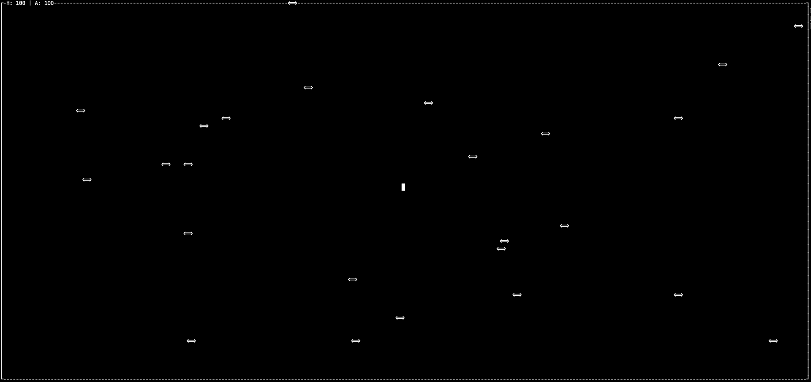

# 🕹️ Pantrix – A Terminal Survival Game

**Pantrix** is a fast-paced ASCII arcade game played directly in your terminal. Dodge enemies, survive with your armor and health intact, and see how long you can last in this chaotic, pfand-themed microcosm.

NOTE: Project is unter ongoing development :-) Feel free to push your ideas
---

## 📦 Features

- Terminal-based game using pure C
- Responsive player controls with `WASD`
- Dynamic enemies with bounce mechanics
- Health and armor tracking
- ASCII borders, UI info display, and game over screen
- Frame-locked loop at **20 FPS**
- Low-level terminal handling with raw mode and escape sequences

---

---

## 🔧 Installation & Running

### Prerequisites

- GCC or compatible C compiler
- Unix-like OS (Linux/macOS/WSL)
- A terminal window

### Build

```bash
gcc -o pantrix main.c
